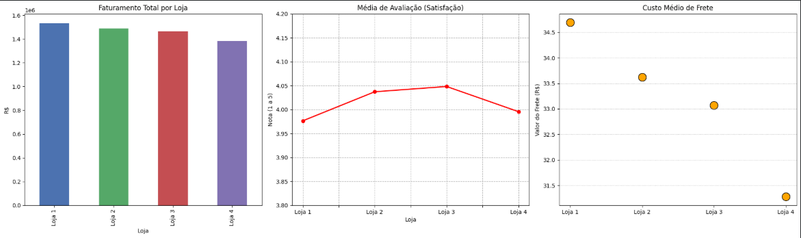

# 📊 Alura Store: Análise de Eficiência e Desempenho

## 📝 Descrição do Projeto

Este projeto foi desenvolvido como parte do **Alura Store Challenge**. O objetivo principal foi auxiliar o Senhor João, proprietário da rede, a identificar qual de suas quatro unidades possui a menor eficiência operacional. Através desta análise, fundamentei a decisão estratégica de qual loja deveria ser vendida para viabilizar um novo empreendimento.

Utilizei técnicas de Ciência de Dados para processar informações de faturamento, logística e satisfação, transformando dados brutos em inteligência competitiva para o negócio.

## 📊 Resultados da Análise (Demonstração)

Abaixo, apresento os pilares visuais que utilizei para diagnosticar a saúde de cada unidade:

### 1. Desempenho Financeiro (Faturamento)
Identifiquei que a **Loja 4** apresenta o menor faturamento total acumulado da rede. Embora a diferença pareça pequena à primeira vista, em um cenário de longo prazo, essa unidade é a que menos contribui para o crescimento do caixa.

### 2. Experiência do Cliente (Satisfação)
Analisei a média de avaliação (rating) e notei que, embora a **Loja 1** tenha o maior faturamento, ela possui o menor índice de satisfação. Esse contraste mostra que o sucesso financeiro atual da unidade 1 pode estar em risco devido à má percepção dos clientes.

### 3. Eficiência Logística (Custo de Frete)
Mensurei o custo médio de frete e identifiquei que a **Loja 4** possui a operação logística mais barata. No entanto, concluí que essa vantagem operacional é **insuficiente para compensar a lacuna de faturamento**, uma vez que a unidade não consegue converter essa economia em volume de vendas ou lucro líquido superior às demais.

---

## 🎯 Conclusões e Decisões Estratégicas

Após o cruzamento de todas as métricas de desempenho, minha recomendação estratégica para o Senhor João foi a **venda da Loja 4**, baseada nos seguintes fatos:

* **Baixa Rentabilidade Global:** Mesmo com o benefício de ter o frete mais barato da rede, a Loja 4 não conseguiu atingir as metas de faturamento das outras unidades.
* **Potencial de Reinvestimento:** Ao vender a unidade com menor tração financeira (Loja 4), o capital liberado terá um ROI (Retorno sobre Investimento) potencialmente maior em um novo empreendimento.
* **Foco em Qualidade:** A análise também indicou que a Loja 1 precisa de um plano de ação urgente para melhorar a satisfação, garantindo que sua liderança em faturamento não seja perdida para a concorrência.

---

## ✅ Funcionalidades (Análises Realizadas)

* **Análise de Faturamento**: Identificação da performance financeira bruta por unidade.
* **Vendas por Categoria**: Mapeamento do perfil de consumo regional.
* **Média de Avaliação**: Diagnóstico da saúde do relacionamento com o cliente.
* **Eficiência Logística**: Comparação de custos de frete vs. performance de vendas.

## 🛠️ Tecnologias Utilizadas

* **Python**: Linguagem base para o desenvolvimento da lógica analítica.
* **Pandas**: Manipulação e tratamento de dados complexos.
* **Matplotlib**: Criação das visualizações gráficas e dashboards.
* **Google Colab**: Ambiente de desenvolvimento em nuvem.

## 🚀 Como Utilizar

1. Acesse o arquivo `AluraStoreBrasil_Análise.ipynb` aqui no repositório.
2. O código e os resultados podem ser visualizados diretamente pelo GitHub.
3. Para executar, clique no botão **"Open in Colab"** no topo deste documento.

## 👩‍💻 Autora

**Mikaela de Paula**

